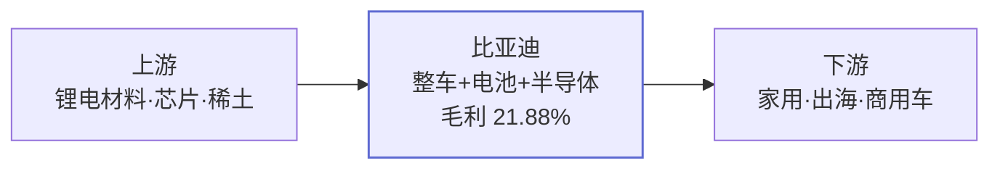

<!-- THESIS_SNAPSHOT_START -->
## 比亚迪（002594.SZ）标的速写
新能源整车规模化 + 电池外供放量的双轮模型。
<!-- THESIS_SNAPSHOT_END -->

## Step 0 · 任务锁定

| 字段 | 值 |
|---|---|
| 标的 | 比亚迪（002594.SZ） |
| 周期 | 中线 1-2 季 |
| 数据截止日 | 2026-05-15 |
| 研究状态 | 持续跟踪 |
| 风格预判 | 配置型 |

## Step 0.5 · 核心异常分析

暂无 CRITICAL/HIGH 级异常。

## Step 1 · 宏观与周期定位

- 经济周期：复苏中期 [I:乘联会 2026-04 月报]
- 政策阶段：发力期 [I:汽车以旧换新政策延续]
- 核心矛盾：海外加速 vs 国内价格战

## Step 2 · 产业链深度拆解

### 2a. 题材来源判断

主业确定性强（整车 + 电池一体化），向"海外 + 高端化"两个方向延伸。

### 2b. 产业链图



### 2c. 业务线拆解

| 业务线 | 营收占比 | 毛利率 | 趋势三要素 |
|---|---|---|---|
| 整车 | 79% | 21% | 3/3 趋势确认 |
| 电池外供 | 12% | 15% | 2/3 可跟踪 |

## Step 3 · 公司质地评分

### 3a. 正面筛选清单

- 市值：6800 亿 [F:quote.market_cap]，达"百亿优先"标准
- 行业地位：全球新能源乘用车销量第一 [I:乘联会·2025 年度]
- 现金流：2025 经营性现金流 / 营收 = 0.18 [C: 1500/8500]

### 3b. 不碰清单（负面排查）

- [ ] 市值 50 亿以下？ — 不适用
- [ ] 蹭概念？ — 否，主业坚实
- [ ] 看不到业绩落地？ — 否，季报持续验证

### 3d. 股权结构与公司治理

控股股东比亚迪实业（27%），无重大股东减持。机构持仓占比 38%。

## Step 4 · 业绩弹性测算

### 4a. 弹性树（ASCII）

```
比亚迪
├── 整车（55%）
│   └── 销量每 +10% → 净利 +30 亿
├── 电池外供（12%）
│   └── 出货 +20% → 净利 +8 亿
└── 电子组装（8%）
    └── 毛利稳定，影响有限
```

### 4b. 价格敏感度公式

- 整车 ASP 每 +5000 元 → 年增毛利 ~50 亿 [C:10M × 5000 × 100%]
- 电池外供出货量每 +10GWh → 年增营收 ~150 亿 [I:行业价 1.5元/Wh]

### 4c. 情景分析

| 情景 | 触发条件 | 营收（亿） | 净利（亿） | EPS（元） | PE-2026E |
|---|---|---|---|---|---|
| 悲观 | 海外受阻 | 8200 | 420 | 14.4 | 16x |
| 基准 | 海外加速兑现 | 9200 | 530 | 18.2 | 16x |
| 乐观 | 海外 + 高端 | 10200 | 650 | 22.3 | 14x |

## Step 5 · 风险分析

### 5a. 风险清单

| 风险类型 | 具体场景 | 影响 | 概率 |
|---|---|---|---|
| 行业周期 | 国内价格战延续 | 高 | 中 |
| 竞争格局 | 特斯拉 Q3 降价 | 中 | 中 |
| 客户集中度 | — | 低 | 低 |

### 5b. 逻辑破坏条件

1. 4 月销量同比转负 [F:乘联会]
2. 电池外供毛利率跌破 12% [C:成本结构]
3. 海外销量增速 < 15% [I:经销商口径]

## Step 6 · 估值与买卖时机

### 6a. 估值方法选择

成长 + 周期混合定位，主用 PE 26x（2026E）+ 辅以 PB 4x。

### 6a+. 资金面分析

近 20 日北向资金净流入 12 亿 [F:fund_flow]，融资余额占比稳定。

### 6a++. 技术面分析

MA20/MA60 多头排列；当前 PE 历史 35% 分位 [C:历史 PE 区间]。

### 6b. 期货关联

碳酸锂期货低位震荡，对整车毛利端构成温和利好。

### 6c. 研报对比

| 机构 | 日期 | 目标价 | 是否采纳 |
|---|---|---|---|
| 中金 | 2026-04-22 | 310 | 部分（中位偏高） |
| 中信 | 2026-04-15 | 285 | 是 |

### 6d. 三档目标价 [T:base PE 22x · EPS26E 13.18]

（partial 渲染）

### 6e. 盈亏比

向下空间 ¥230（-8%）/ 向上空间 ¥290（+16%）→ 盈亏比 2.8:1

### 6f. 框架原则对照

- 低位谈逻辑 / 高位讲情绪 → 当前估值分位 35%，宜聚焦逻辑
- 盈亏比思维 → 满足"2:1 以上"门槛

## Step 7 · 对标与对比分析

| 维度 | 比亚迪 | 赛力斯 | 宁德时代 |
|---|---|---|---|
| 业务模型 | 整车+电池+半导体 | 整车（华为生态） | 电池纯供应 |
| 2026 PE | 16x | 22x | 18x |
| 增长引擎 | 海外 + 高端 | M9 系列 + 海外 | 储能 + 海外 |
| 适合风格 | 配置型 | 交易型 | 配置型 |

**关键区别**：比亚迪垂直一体化优势更强，估值更具防御性。

## Step 8 · 跟踪计划与综合结论

### 8a. 分层跟踪锚点

| 频率 | 跟踪内容 | 数据源 |
|---|---|---|
| 周度 | 销量同比 | 乘联会 |
| 月度 | 海外销量 | 公司公告 |
| 季度 | 单季毛利率 | 财报 |

### 8b. 执行清单

- 短线触发买点：跌破 ¥230 形成右侧
- 中线持仓基础：2026Q2 销量增速 > 15%
- 失效信号：4 月销量同比转负

### 8c. 综合结论

- **一句话判断**：处于"业绩兑现 + 海外提速"的趋势确认阶段
- **风险等级**：中
- **风格标签**：配置型
- **操作建议**：核心配置 + 择时左侧加仓
